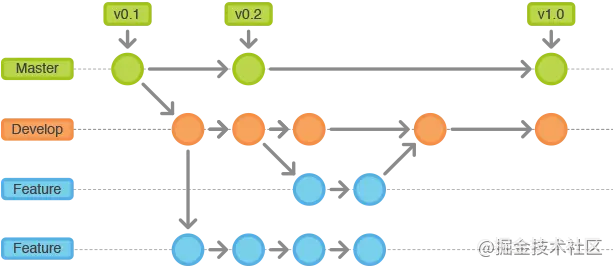
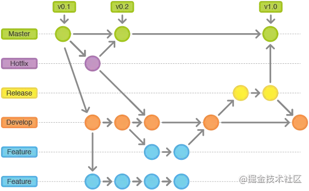
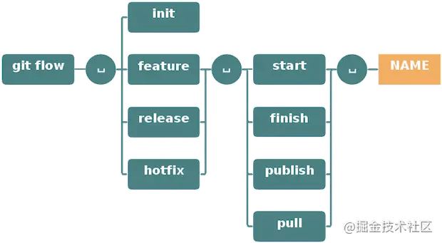

## GitFlow 介绍

虽然有 Git 这样优秀的版本管理工具，但是我们面对版本管理的时候，依然有非常大的挑战，我们都知道大家工作在同一个仓库上，那么彼此的代码协作必然带来很多问题和挑战，如下：

1. 如何开始一个 Feature 的开发，而不影响别的 Feature？
2. 由于很容易创建新分支，分支多了如何管理，时间久了，如何知道每个分支是干什么的？
3. 哪些分支已经合并回了主干？
4. 如何进行 Release 的管理？开始一个 Release 的时候如何冻结 Feature, 如何在 Prepare Release 的时候，开发人员可以继续开发新的功能？
5. 线上代码出 Bug 了，如何快速修复？而且修复的代码要包含到开发人员的分支以及下一个 Release?
6. 大部分开发人员现在使用 Git 就只是用三个甚至两个分支，一个是 Master, 一个是 Develop, 还有一个是基于 Develop 打的各种分支。这个在小项目规模的时候还勉强可以支撑，因为很多人做项目就只有一个 Release, 但是人员一多，而且项目周期一长就会出现各种问题。

诸如以上问题，代码需要代码规范一样，同样代码管理也需要一个清晰的流程和规范，荷兰程序员 Vincent Driessen 为了解决这个问题提出了[A Successful Git Branching Model](https://link.juejin.cn?target=https%3A%2F%2Fnvie.com%2Fposts%2Fa-successful-git-branching-model%2F)。流程图如下：


- Gitflow 工作流程围绕项目发布定义了严格的分支模型。尽管它比 Feature Branch Workflow 更复杂一些，但它也为管理更大规模的项目提供了坚实的框架。
- 与 Feature Branch Workflow 比起来，Gitflow 流程并没有增加任何新的概念或命令。 其特色在于，它为不同的分支分配了非常明确的角色，并且定义了使用场景和用法。除了用于功能开发的分支，它还使用独立的分支进行发布前的准备、记录以及后期维护。当然，你还是能充分利用 Feature Branch Workflow 的好处：拉拽请求（Pull Request）、隔离的试验以及更高效率的合作。

## GitFlow 常用分支

### master

- 主分支, 产品的功能全部实现后, 最终在 `master` 分支对外发布;
- 该分支为只读唯一分支, 只能从其他分支`(release/hotfix)`合并, 不能在此分支修改;
- 另外所有在 `master` 分支的推送应该打标签做记录, 方便追溯;
- 例如 `release` 合并到 `master`, 或 `hotfix` 合并到 `master`。

### develop

- 主开发分支, 基于 `master` 分支克隆;
- 包含所有要发布到下一个 `release` 的代码;
- 该分支为只读唯一分支, 只能从其他分支合并;
- `feature` 功能分支完成, 合并到 develop(不推送);
- `develop` 拉取 `release` 分支, 提测;
- `release/hotfix` 分支上线完毕, 合并到 `develop` 并推送。

### feature

- 功能开发分支, 基于 `develop` 分支克隆, 主要用于新需求新功能的开发;
- 功能开发完毕后合到 `develop` 分支(未正式上线之前不推送到远程中央仓库!!!);
- `feature` 分支可同时存在多个, 用于团队中多个功能同时开发 , 属于临时分支 , 功能完成后可选删除。

### release

- 测试分支, 基于 `feature` 分支合并到 `develop` 之后, 从 `develop` 分支克隆;
- 主要用于提交给测试人员进行功能测试, 测试过程中发现的 BUG 在本分支进行修复, 修复完成上线后合并到 `develop/master` 分支并推送(完成功能), 打 Tag
- 属于临时分支, 功能上线后可选删除。

### hotfix

- 补丁分支, 基于 `master` 分支克隆, 主要用于对线上的版本进行 BUG 修复;
- 修复完毕后合并到 `develop/master` 分支并推送, 打 Tag;
- 属于临时分支, 补丁修复上线后可选删除;
- 所有 `hotfix` 分支的修改会进入到下一个 `release`。

## 工作原理

### master 分支

`master` 分支为初始分支, 也是用于记录历史的分支, 所有在 `master` 分支上的 Commit 应该 Tag。

GitFlow 使用两个分支来记录项目开发的历史, 而不是使用单一的 `master` 分支。在 Gitflow 流程中，`master` 只是用于保存官方的发布历史，而 `develop` 分支才是用于集成各种功能开发的分支。使用版本号为 `master` 上的所有提交打标签（tag）也很方便。事实上, Gitflow 流程就是围绕这两个特点鲜明的分支展开的。


### Feature 分支

分支名 feature/\*

每一个新功能的开发都应该各自使用独立的分支。 为了备份或便于团队之间的合作，这种分支也可以被推送到中央仓库。 但是，在创建新的功能开发分支时，父分支应该选择 `develop`（而不是 master）。 当功能开发完成时，改动的代码应该被合并（merge）到 `develop` 分支。功能开发永远不应该直接牵扯到 `master`。



### Release 分支

分支名 release/\*

`release` 分支基于 `develop` 分支创建，打完 `release` 分之后，我们可以在这个 `release` 分支上测试，修改 Bug 等。同时，其它开发人员可以基于开发新的 `feature`。 (注意：一旦打了 `release` 分支之后不要从 `develop` 分支上合并新的改动到 `release` 分支)

发布 `release` 分支时，合并 `release` 到 `master` 和 `develop`， 同时在 `master` 分支上打个 Tag 记住 `release` 版本号，然后可以删除 `release` 分支了。


### Hotfix 分支

分支名 hotfix/\*

`hotfix` 分支是维护分支，基于 `master` 分支创建。发布后的维护工作或者紧急问题的快速修复也需要使用一个独立的分支。这是唯一一种可以直接基于 `master` 创建的分支。一旦问题被修复了，所做的改动应该被合并入 `master` 和 `develop` 分支（或者用于当前发布的分支）。在这之后，`master` 上还要使用更新的版本号打好 Tag。



## 工作主要流程

1. 初始化项目为 `gitflow`, 默认创建 `master` 分支, 然后从 `master` 拉取第一个 `develop` 分支;
2. 从 `develop` 拉取 `feature` 分支进行编码开发(多个开发人员拉取多个 feature 同时进行并行开发, 互不影响);
3. `feature` 分支完成后, 合并到 `develop`(不推送, feature 功能完成还未提测, 推送后会影响其他功能分支的开发),合并 `feature` 到 `develop`, 可以选择删除当前 `feature`, 也可以不删除, 但当前 `feature` 就不可更改了, 必须从 `release` 分支继续编码修改

4. 从 `develop` 拉取 `release` 分支进行提测, 提测过程中在 `release` 分支上修改 BUG;

5. `release` 分支上线后, 合并 `release` 分支到 `develop/master` 并推送, 合并之后, 可选删除当前 `release` 分支, 若不删除, 则当前 `release` 不可修改。 线上有问题也必须从 `master` 拉取 `hotfix` 分支进行修改;

6. 上线之后若发现线上 BUG, 从 `master` 拉取 `hotfix` 进行 BUG 修改;

7. `hotfix` 通过测试上线后, 合并 `hotfix` 分支到 `master/develop` 并推送, 合并之后, 可选删除当前 `hostfix`, 若不删除, 则当前 `hotfix` 不可修改, 若补丁未修复, 需要从 `master` 拉取新的 `hotfix` 继续修改;

8. 当进行一个 `feature` 时, 若 `develop` 分支有变动, 如其他开发人员完成功能并上线, 则需要将完成的功能合并到自己分支上,即合并 `develop` 到当前 `feature` 分支;

9. 当进行一个 `release` 分支时, 若 `develop` 分支有变动, 如其他开发人员完成功能并上线, 则需要将完成的功能合并到自己分支上, 即合并 `develop` 到当前 `release` 分支 (!!! 因为当前 release 分支通过测试后会发布到线上, 如果不合并最新的 develop 分支, 就会发生丢代码的情况)。

## GitFlow 流程命令代码示例

### 一般命令代码

#### 创建 develop 分支

给默认的 `master` 配备一个 `develop` 分支, 一种简单的做法是：让一个开发者在本地建立一个空的 `develop` 分支, 然后把它推送到服务器。`develop `分支将包含项目的所有历史，而 `master` 会是一个缩减版本。现在，其他开发者应该克隆（clone）中央仓库，并且为 `develop` 创建一个追踪分支。

```shell
git branch develop
git push -u origin develop
```

#### 开始新 Feature 开发

当我们开始开发新功能时，我们需要各自建立了自己的分支。注意，在创建分支时，父分支不能选择 `master`，而要选择 `develop`。

```shell
git checkout -b feature/xxx develop
# Optionally, push branch to origin:
git push -u origin feature/xxx
```

#### 修改

```shell
git status
git add some-file
git commit
```

#### 完成 Feature

当新功能开发完毕时，需要将代码合并到 `develop` 分支，并删除 `feature` 分支。

```shell
git pull origin develop
git checkout develop
git merge --no-ff feature/xxx
git push origin develop

git branch -d feature/xxx

# If you pushed branch to origin:
git push origin --delete feature/xxx
```

#### 开始 Relase

当功能开发完成时需要新建一个分支来进行产品代码发布的相关工作，这个分支专门用于发布前的准备，包括一些清理工作、全面的测试、文档的更新以及任何其他的准备工作。它与用于功能开发的分支相似，不同之处在于它是专为产品代码发布服务的。一旦创建了这个分支并把它推向中央仓库，这次产品发布包含的功能也就固定下来了。 任何还处于开发状态的功能只能等待下一个发布周期。

```shell
git checkout -b release/v1.0.0 develop

# Optional: Bump version number, commit
# Prepare release, commit
```

#### 完成 Release

一切准备就绪之后，就要把发布分支合并入 `master` 和 `develop` 分支， 并为 `master` 分支打上合适的标签，然后再将发布分支删除。注意，往 `develop` 分支的合并是很重要的，因为开发人员可能在发布分支上修复了一些关键的问题，而这些修复对于正在开发中的新功能是有益的。再次提醒一下，如果 A 功能团队强调代码评审（Code Review），此时非常适合提出这样的请求。

```shell
git checkout master
git merge --no-ff release/v1.0.0
git push

git checkout develop
git merge --no-ff release/v1.0.0
git push

git branch -d release/v1.0.0

# If you pushed branch to origin:
git push origin --delete release/v1.0.0

git tag -a v1.0.0 master
git push --tags
```

#### 开始 Hotfix

如果线上发现 Bug，需要从 `master` 分支新建一个维护分支来修复线上 Bug。

```shell
git checkout -b hotfix/v1.1.1 master
```

#### 完成 Hotfix

当 bug 修复完毕，需要将代码合并到 `master/develop` 分支， 并将 `master` 打上 Tag， 最后删除维护分支。

```shell
git checkout master
git merge --no-ff hotfix/v1.1.1
git push

git checkout develop
git merge --no-ff hotfix/v1.1.1
git push

git branch -d hotfix/v1.1.1

git tag -a v1.1.1 master
git push --tags
```

### GitFlow 命令代码

- 初始化：

```shell
git flow init
```

这个命令会进行一些默认的配置，可以自动创建上面介绍的所有分支：`master`、`develop`、`feature`、`relase`、`hotfix`等分支。 完成后当前所在分支就变成 develop. 任何开发都必须从 develop 开始。

- 开始新 Feature:

```shell
git flow feature start MYFEATURE
```

该命令会创建一个 `feature` 分支

- 完成一个 Feature:

```shell
git flow feature finish MYFEATURE
```

该命令将会把 `feature/MYFEATURE` 合并到 `develope` 分支，然后删除功能(feature)分支。

- Publish 一个 Feature(也就是 push 到远程服务器):

```shell
git flow feature publish MYFEATURE
```

- 获取 Publish 的 Feature:

```shell
git flow feature pull origin MYFEATURE
```

- 开始一个 Release:

```shell
git flow release start RELEASE BASE
```

- 发布 Release:

```shell
git flow release finish RELEASE
```

当完成(finish)一个发布分支时，它会把所有的修改合并到 `master` 分支，同时合并回 `develop` 分支，所以不需要担心 `master` 分支比 `develop` 分支更加超前。

- Publish 一个 Release:

```shell
git flow release publish RELEASE
```

- 注意打标签:

```shell
git push --tags
```

- 开始一个 Hotfix:

```shell
git flow hotfix start VERSION BASENAME
```

- 发布一个 Hotfix:

```shell
git flow hotfix finish VERSION
```

当完成(finish)一个维护分支时，它会把所有的修改合并到 `master` 分支，同时合并回 `develop` 分支。


